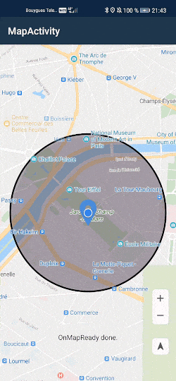
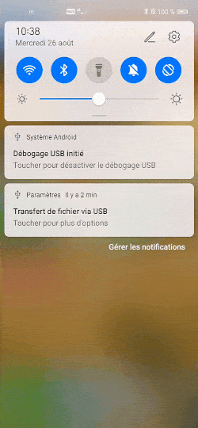

# Xamarin Android Huawei Mobile Services demo

The purpose of this project is to showcase how to use Huawei Mobile Services in Xamarin.

This sample project ports code from Huawei Developers samples in Xamarin using prebuilt nuget packages.
Xamarin bindings can be found there : [https://github.com/johnthiriet/Xamarin.Android.Huawei.Hms](https://github.com/johnthiriet/Xamarin.Android.Huawei.Hms)

It covers :
- MapKit [https://developer.huawei.com/consumer/en/hms/huawei-MapKit](https://developer.huawei.com/consumer/en/hms/huawei-MapKit)
- Location [https://developer.huawei.com/consumer/fr/hms/huawei-locationkit](https://developer.huawei.com/consumer/fr/hms/huawei-locationkit)
- Push [https://developer.huawei.com/consumer/en/hms/huawei-pushkit](https://developer.huawei.com/consumer/en/hms/huawei-pushkit)
- Analytics [https://developer.huawei.com/consumer/en/hms/huawei-analyticskit](https://developer.huawei.com/consumer/en/hms/huawei-analyticskit)
- ScanKit [https://developer.huawei.com/consumer/en/hms/huawei-scankit](https://developer.huawei.com/consumer/en/hms/huawei-scankit)

The map sample uses a custom clustering code that has also been built and bound to Xamarin. The original project can be found here : [https://github.com/hunterxxx/huawei-map-clustering](https://github.com/hunterxxx/huawei-map-clustering).

# Running the sample

In order to run the sample you will need to have a Huawei Developer account. To register and manage your applications, go there [https://developer.huawei.com](https://developer.huawei.com). If you have ever added Google Maps support in an Android application, the process will feel really similar.

- Create a project on the Developer portal
- Activate Location, Maps and Push SDKs (refer to official documentations for that).
- Create your keystore key and use it for signing your application.
- Add the Sha256 of the keystore to your project settings in the Huawei Developer portal.
- Download and replace the `agconnect-services.json` file in the solution with yours.
- Update the application id with yours in the AndroidManifest.xml file in the `android:name="com.huawei.hms.client.appid"` meta-data.

## Sample running

### Map, pins and custom drawing

### Pins clustering

### Push

